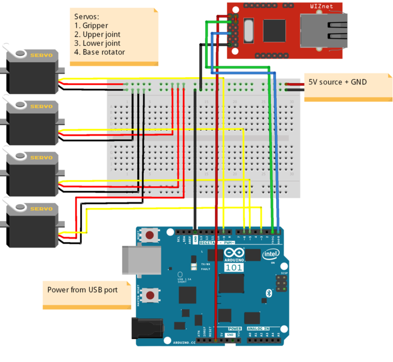

# Fruit Detection and Sorting by Robotic Arm using real-time Image Processing

   


This is a project repository for my Research Methodology course at Lakehead University!

To understand the installation and road-map of the project, simply follow the steps in table of instructions.


***

## Table of Contents

0. [Description](#Description)
1. [Manifest](#Manifest)
2. [Dataset](#Dataset)
3. [Libraries](#Libraries)
4. [Arduino-Setup](#Arduino-Setup)
5. [Connections](#Connections)
6. [Usage](#Usage)
7. [Evaluation and Results](#Evaluation and Results)
8. [Training & Evaluation](#Training)
9. [Testing](#Testing)
10. [References](#References)
11. [License](#License)
12. [Project Status](#Project-status)
***

## Description

Image processing captures a lot of interest in today’s world since it opens up new opportunities for application in a variety of high-tech sectors. The image processing technique detects objects (fruits) based on colour, size, and shape in real time using a USB camera and then identifies information from it. Image processing methods then process this information for the pick and place by grabbing and arranging the objects in their preprogrammed locations. The objective is to develop a fruit detection system that employs a 3-DOF (degrees of freedom) robotic arm to pick and move an object (fruit) from one position to another. Upon fruit detection, a signal is sent to a microcontroller which thereby transmits another signal to the circuit that drives the different motors of the robotic arm to grasp the object and position it in the desired spot. As a result, the tedious job done by humans is eliminated, and the task is completed with greater accuracy and speed. This work presents the development of a vision-assisted pick and place robotic arm for fruit recognition and sorting using a faster Region-based Convolutional Neural Network (R-CNN) which has higher accuracy and is more efficient than other methods. The main aim is to build an efficient autonomous and real-time fruit sorting system. 

 [Contact me](kadil@lakeheadu.ca) if you have any questions or need assistance with the project.
***

## Manifest

A brief descrption of the top-level folders/files of this repository.

```
Code For Robotic Arm ----------------> This folder contains the code for the robotic arm.
Dataset -----------------------------> This folder contains the 3 fruits dataset.
Detection Code .py ------------------> It contains the python code for fruit detection.
Fruit-Recognition-using-RCNN.ipynb --> This is the proposed algorithm code for project.
README.md ---------------------------> The file with all the information and a guide through this project.
```
***


## Dataset

[Click here](https://github.com/muneebuddinadil/fruit-detection/tree/main/Dataset) to download the dataset directly from my repository or [click here](https://github.com/Horea94/Fruit-Images-Dataset/tree/master/Test) to download from the dataset I have taken images from. The name of the dataset used is "[Fruits-360 Dataset](https://www.kaggle.com/moltean/fruits)". The fruits data evaluated for this research are made up of three fruit varieties: apples, oranges and bananas. All the pictures had a
white background and were 100 x 100 pixels in size. Some of the images are chosen as training sets,  some for validation and some as testing sets.
***

## Libraries
After you've downloaded the dataset, you'll need to set up your Google Colab notebook by downloading all of the required libraries, as indicated below.

```py
import os
import csv
import cv2
import math
import glob
import random
import warnings
import operator
import itertools
import numpy as np 
import pandas as pd 
import seaborn as sns
import tensorflow as tf
import matplotlib.pyplot as plt
from utils import backbone
from keras.optimizers import Adam
from keras.models import Sequential
from subprocess import check_output
from api import object_counting_api
from keras.utils import to_categorical
from sklearn.metrics import confusion_matrix
from keras.callbacks import ReduceLROnPlateau
from keras.utils.np_utils import to_categorical
from sklearn.model_selection import  train_test_split
from keras.preprocessing.image import ImageDataGenerator
from keras.layers import Dense,Dropout,Flatten,Conv2D,MaxPool2D
```
***

## Arduino-Setup

Go-to [this folder](https://github.com/muneebuddinadil/fruit-detection/tree/main/Code%20For%20Robotic%20Arm) and download the code for robotic arm. These codes are stored in the micro-controller Arduino UNO. The codes are for the rotation of robotic arm in 3 different directions (DOF- Degrees of Freedom) and gripper code. The code also contains specified angles for object (fruit) drop location. 
***

## Connections 

Follow the diagram below to make connections from your Arduino UNO to the Robotic Arm.


***

## Usage 

To get started with Google Colab, copy each ipynb Notebook in this repository to your own drive and open it directly! In order to train our model, we must first setup the optimizer with learning rate and decay parameters. You can also download the [dataset](https://github.com/muneebuddinadil/fruit-detection/tree/main/Dataset) and train the model in your notebook or can directly use the trained files of my repository. 

You are welcome to **contribute** your work to this repository.
```
git clone 'https://github.com/muneebuddinadil/fruit-detection.git'
```
**

## Evaluation and Results


